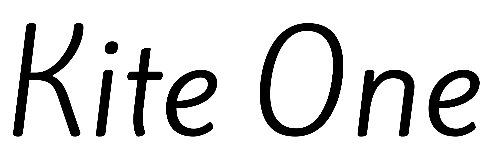
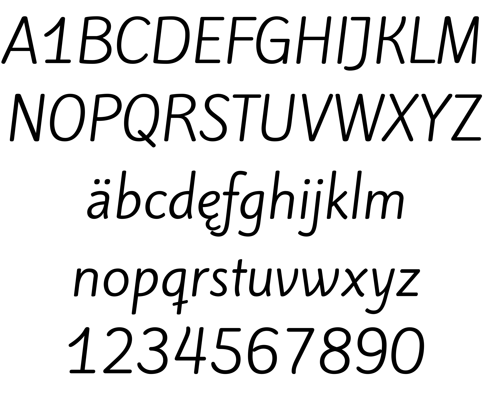

### Kite One

Kite One is a rounded, monoline, humanist sans serif typeface. With an inclination of 7 degrees, it gives a fluid reading experience. Long ascenders and descenders, soft shapes, open counterforms and soft terminals, make Kite One a typeface that is very suitable for long texts, especially those associated with the natural world or children’s tales.

### Designer

* Eduardo Rodríguez Tunni

### License

Licensed under the [*SIL Open Font License, 1.1*](https://scripts.sil.org/OFL); you may not use this file except in compliance with the License.

To contribute to the project contact Eduardo Rodríguez Tunni > edu@tipo.net.ar
